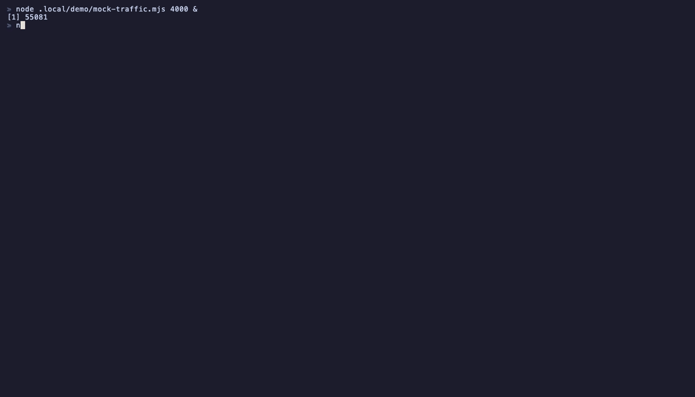

# netwatch

Terminal-based network inspector for React Native apps. Captures HTTP requests and displays them in a flicker-free split-pane TUI.




## Features

- **Split-pane TUI** — request list (left) + detail view (right) with borders
- **Flicker-free rendering** — Ink incremental rendering + synchronized output (BSU/ESU)
- **JSON syntax highlighting** — colored keys, strings, numbers, booleans in response bodies
- **Status badges** — background-colored status codes with descriptions (200 OK, 404 Not Found, etc.)
- **Headers toggle** — press `h` to show/hide request/response headers
- **Fuzzy filtering** — press `/` to search by URL, method, or status
- **Mouse support** — click to focus panes, scroll wheel on focused pane, hover highlighting
- **Follow-cursor scrolling** — request list viewport follows selection
- **Request/response toggle** — press `r` to switch between request and response body
- **Pause capture** — press `p` to pause incoming requests
- **Terminal resize** — layout adjusts dynamically on window resize
- **Config file** — `.netwatchrc` for port, ignored URLs, max requests
- **Dual protocol** — supports both `netwatch-client` and Reactotron simultaneously
- **Auto-reconnect** — `netwatch-client` reconnects automatically, start server anytime

## Quick Start

```bash
# Clone and install
git clone https://github.com/kmelkon/netwatch.git
cd netwatch
npm install --registry https://registry.npmjs.org/

# Run
npm start
```

## Client Setup (Recommended)

Install `netwatch-client` in your React Native app — zero dependencies, patches `fetch` directly:

```bash
npm install netwatch-client
```

```typescript
// App.tsx or index.js
if (__DEV__) {
  require("netwatch-client").connect({ name: "MyApp" });
}
```

That's it. The client auto-connects to netwatch on `localhost:9090` with exponential backoff — start the server anytime, no app restart needed.

### Client Options

```typescript
connect({
  host: "localhost",     // server host
  port: 9090,            // server port
  name: "MyApp",         // display name in netwatch
  platform: "ios",       // optional platform tag
  ignoredUrls: [         // substring match, skip noisy URLs
    "/symbolicate",
    "/logs",
  ],
});
```

### What gets captured

`netwatch-client` only patches `fetch()` — it does **not** intercept `XMLHttpRequest`. This means your app's HTTP calls are captured, but background traffic from third-party SDKs (e.g. Optimizely, analytics) that use XHR or native HTTP modules won't appear. This is usually desirable since it keeps the request list focused on your app's traffic.

Reactotron's `networking()` plugin patches XHR, so it captures both your app traffic and SDK traffic.

## Reactotron Setup

Both protocols work on the same port simultaneously — use whichever fits your project.

```typescript
import Reactotron from "reactotron-react-native";

Reactotron.configure({
  host: "localhost",
  port: 9090,
})
  .useReactNative({ networking: true })
  .connect();
```

> **Tip:** Reactotron doesn't auto-reconnect. Add `onDisconnect` to retry:
>
> ```typescript
> Reactotron.configure({
>   host: "localhost",
>   port: 9090,
>   onDisconnect: () => setTimeout(() => Reactotron.connect(), 3000),
> })
> ```

## Keyboard Shortcuts

| Key | Action |
|-----|--------|
| `↑↓` / `j/k` | Navigate request list |
| `u` / `d` | Scroll detail pane |
| `r` | Toggle request/response body |
| `h` | Toggle headers display |
| `/` | Focus filter input |
| `Esc` | Exit filter |
| `b` | Bookmark selected request |
| `B` | Toggle bookmarks-only filter |
| `x` | Copy as cURL |
| `e` | Export (HAR/JSON) |
| `c` | Clear all requests (double-tap) |
| `p` | Pause/resume capture |
| `q` | Quit |

## Mouse Support

- **Click** a pane to focus it (cyan border)
- **Scroll wheel** on the focused pane to scroll content
- **Hover** highlights pane border (yellow)

Requires a terminal with mouse support (iTerm2, kitty, WezTerm, Windows Terminal).

## Configuration

Create a `.netwatchrc` file in your project root or `~/.netwatchrc`:

```json
{
  "port": 9090,
  "ignoredUrls": ["/symbolicate", "/logs"],
  "maxRequests": 500
}
```

| Option | Default | Description |
|--------|---------|-------------|
| `port` | `9090` | WebSocket server port |
| `ignoredUrls` | `[]` | URL patterns to ignore (substring, glob, or regex) |
| `maxRequests` | `500` | Max stored requests |

The `NETWATCH_PORT` environment variable overrides the config file port.

## Tech Stack

- [Ink](https://github.com/vadimdemedes/ink) — React for terminal UIs
- [Zustand](https://github.com/pmndrs/zustand) — state management
- [Fuse.js](https://fusejs.io/) — fuzzy search
- [ws](https://github.com/websockets/ws) — WebSocket server
- [chalk](https://github.com/chalk/chalk) — terminal styling

## Development

```bash
npm run dev        # Watch mode
npm test           # Run tests
npm run test:watch # Watch tests
```
